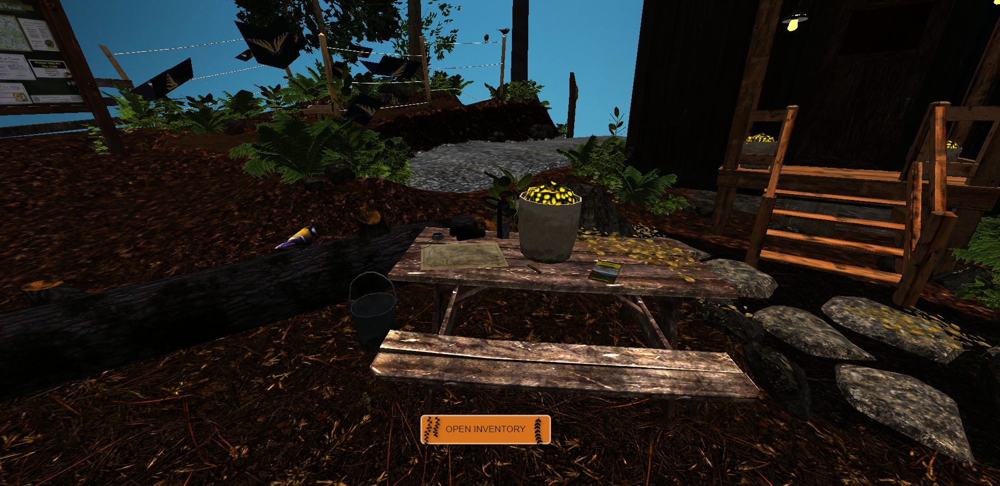
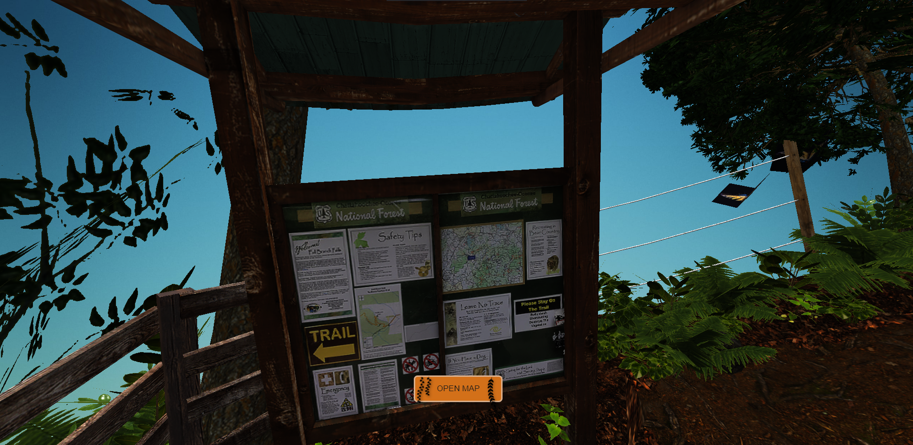
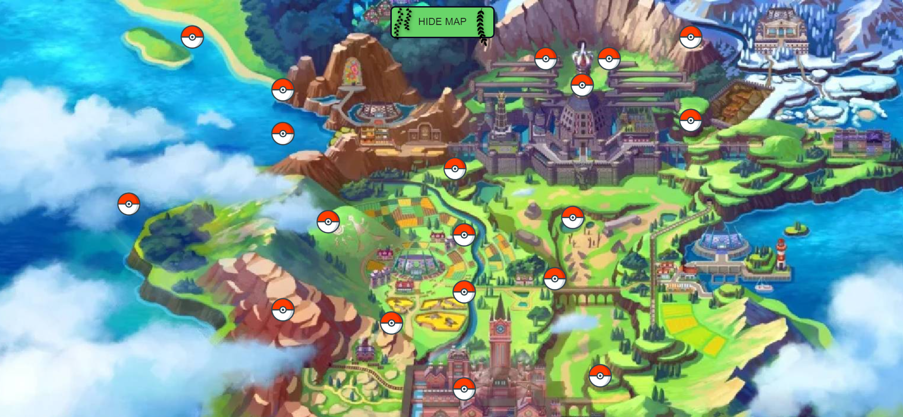
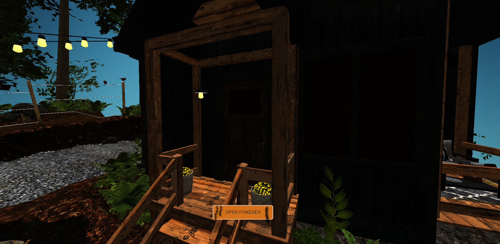

# gotta-fetch-em-all
```# Gotta fetch 'em all!

## Project Description

Our project represents a Pokemon game, where you can explore a 3D sky island. By going to specific locations on the map!, different actions become available like buying pokemons, or navigating on a map full of locations and choosing your pokemons to battle. On each location on the map, you'll encounter a pokemon which you have to defeat in order to acquire experience and coins, which can be used to buy stronger pokemons.


### Technologies Used

We utilized the following technologies:

- **Express.js**: Backend development, creating APIs.
- **MongoDB**: Storing user data and food information.
- **React**: Dynamic UI components.
- **Vite**: Fast build tool.
- **Bootstrap**: Responsive styling.
- **CSS**: Custom styling.
- **Email-validator**: Ensures proper email validation.

### Challenges

Challenges faced during development:

- Finding a suitable pokemon API which contained all the information we need.
- Designing the battle scene to make it look as realistic as possible.

### Future Plans

Our plans for the future:

- Adding gravity and collision on the map for a better gameplay experience.
- Adding special powers and different battle scenes depending on the pokemon.
- Create a 3D battle.

## Setup

### Backend Setup:

1. **Install Dependencies:**

   - Navigate to the `server` directory in your terminal.
   - Run: `npm install` or `pnpm install`.

2. **Run the Server:**

   - Run: `npm run dev` to start the server.

### Frontend Setup:

1. **Prerequisites:**

   - Ensure Node.js is installed and properly configured.

2. **Install Dependencies:**

   - Navigate to the `frontend` directory.
   - Run: `npm install` or `pnpm install`.

3. **Run the Frontend:**

   - Run: `npm run dev`.
   - Click the provided link to open the Pokemon game.

### How to play

   - MOVEMENT : W, A, S, D AND SPACE
   - Pressing ESCAPE makes your cursor appear. Use it to click any buttons from the map.

### Locations

At the start location, the table in the center of the map the OPEN INVENTORY button will appear. By clicking on it, you can see the pokemons that you own.



If you go to the map, the OPEN MAP button will appear. By clicking on it, you will see the map full of locations for battle.




If you go to the cabin, the OPEN POKEDEX button will appear. By clicking on it, you can see the shop for all the pokemons.


 
## Code Contributors

- Bogdan Diaconu: [GitHub Profile](https://github.com/bogdandiaconupv)
- Paul Costea: [GitHub Profile](https://github.com/Paaul2121)
- Iacob Oliver: [GitHub Profile](https://github.com/IacobOliver)
```